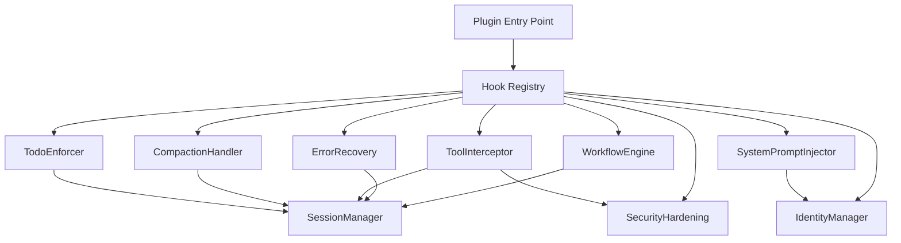

# Component Spec: Core Plugin Architecture

## Overview

This spec defines the core plugin architecture components that implement Atreides orchestration logic via OpenCode hooks. These components work together to provide workflow tracking, error recovery, security validation, and system prompt injection.

**References**:
- Technical Plan: spec:bf063507-9358-4515-afbb-3080f2099467/5cdb5788-a716-4cb2-a301-6ccd6f64a488
- Master Plan: file:ATREIDES_OC_MASTER_PLAN.md (Section 3: Technical Architecture)
- Deep Dive: file:archive/ATREIDES_DEEP_DIVE_FINDINGS.md

---

## Component Architecture



---

## 1. WorkflowEngine

**Purpose**: Track and enforce 5-phase workflow progression

**Workflow Phases**:
1. **Intent**: Understand user's goal
2. **Assessment**: Evaluate scope and approach
3. **Exploration**: Gather context and information
4. **Implementation**: Execute changes
5. **Verification**: Validate results

**Hooks**: `tool.execute.after`, `stop`

**Responsibilities**:
- Classify user intent from messages
- Track current workflow phase in session state
- Detect phase transitions based on tool usage patterns
- Provide phase-specific guidance via system prompt
- Enforce phase completion before allowing stop

**State Management**:
```typescript
interface WorkflowState {
  currentPhase: WorkflowPhase
  phaseHistory: PhaseTransition[]
  intentClassification?: string
}
```

**Phase Transition Logic**:
- Intent → Assessment: After initial exploration
- Assessment → Exploration: When gathering context
- Exploration → Implementation: When making changes
- Implementation → Verification: After changes complete
- Verification → Intent: After validation, ready for new task

**Implementation Notes**:
- Phase detection based on tool patterns (e.g., `read` → Exploration, `edit` → Implementation)
- Heuristic-based classification (not ML)
- Graceful degradation if classification fails

---

## 2. ErrorRecovery

**Purpose**: Detect errors and implement 3-strike recovery protocol

**Error Detection**:
- 22 error patterns from deep dive findings
- Command not found, permission denied, syntax errors, etc.
- Pattern matching on tool output

**3-Strike Protocol**:
1. **Strike 1**: Log error, continue
2. **Strike 2**: Show warning, suggest fixes
3. **Strike 3**: Escalate to Stilgar (Oracle) agent

**Hooks**: `tool.execute.after`

**Responsibilities**:
- Parse tool output for error patterns
- Increment strike counter on errors
- Reset counter on successful tool execution
- Trigger escalation at 3 strikes
- Provide recovery suggestions

**State Management**:
```typescript
interface ErrorRecoveryState {
  strikeCount: number
  lastError?: {
    timestamp: number
    tool: string
    error: string
  }
  escalated: boolean
}
```

**Escalation Mechanism**:
- Inject message suggesting delegation to Stilgar
- Include error context and history
- Reset strike counter after escalation

---

## 3. ToolInterceptor

**Purpose**: Validate and log all tool executions

**Hooks**: `tool.execute.before`, `tool.execute.after`

**Responsibilities**:
- Pre-execution validation (delegates to SecurityHardening)
- Permission checking (via OpenCode's permission system)
- Post-execution logging
- Tool call history tracking
- Performance monitoring

**Validation Flow**:
```
tool.execute.before:
  1. Check tool permissions (OpenCode)
  2. Validate command (SecurityHardening)
  3. Return allow/deny/ask
  
tool.execute.after:
  1. Log execution result
  2. Track in session state
  3. Detect errors (ErrorRecovery)
  4. Update workflow phase (WorkflowEngine)
```

**State Management**:
```typescript
interface ToolCall {
  tool: string
  timestamp: number
  success: boolean
  error?: string
  duration?: number
}
```

---

## 4. SecurityHardening

**Purpose**: Multi-layer security validation

**Security Layers**:

### 4.1 Command Obfuscation Detection
- URL decode (`%XX` → characters)
- Hex escapes (`\xNN` → characters)
- Octal escapes (`\NNN` → characters)
- Quote stripping (`r'm'` → `rm`)
- Backslash continuations

**Pipeline**:
```
Original command → URL decode → Hex decode → Octal decode → Quote strip → Backslash strip → Normalized command
```

### 4.2 Blocked Pattern Matching
**Dangerous Commands** (deny):
- `rm -rf /`, `mkfs`, `dd if=/dev/zero`
- Fork bomb: `:(){ :|:& };:`
- Pipe to shell: `curl ... | bash`, `wget ... | sh`
- Privilege escalation: `sudo su`, `sudo -i`

**Warning Patterns** (ask):
- `sudo`, `chmod`, `chown`
- `git push --force`, `git reset --hard`
- `npm publish`, `docker push`

### 4.3 File Operation Guards
**Blocked Files**:
- `.env*`, `secrets.*`, `*.pem`, `*.key`
- `id_rsa`, `id_dsa`, `authorized_keys`
- `.npmrc`, `.pypirc`, `kubeconfig`

**Blocked Paths**:
- `.ssh/*`, `.aws/*`, `.kube/*`
- `/etc/passwd`, `/etc/shadow`

### 4.4 Log Sanitization
- Remove control characters
- Limit length (500 chars)
- Prevent injection attacks

**Hooks**: Called by ToolInterceptor

**Performance Target**: <15ms per validation

**Error Handling**:
- All validation wrapped in try-catch
- Invalid input defaults to "deny"
- Errors logged but never thrown

---

## 5. SystemPromptInjector

**Purpose**: Inject AGENTS.md orchestration rules into system prompt

**Hooks**: `experimental.chat.system.transform`

**Responsibilities**:
- Read AGENTS.md from file system
- Validate markdown syntax
- Inject into system prompt
- Add identity formatting (persona name, response prefix)
- Merge with existing system prompt

**Injection Strategy**:
```
Original system prompt
+
Identity header ([Muad'Dib]: prefix)
+
AGENTS.md content
+
Delegation announcements
=
Enhanced system prompt
```

**Validation**:
- Parse markdown structure
- Check for required sections
- Fail gracefully if invalid (use default rules, show warning)

**Caching**:
- Cache validated AGENTS.md
- Watch file for changes (optional, post-MVP)
- Revalidate on modification

**Error Handling**:
- If AGENTS.md is invalid: Use default rules, inject warning message
- If file not found: Use default rules only
- Never throw, always return valid prompt

---

## 6. CompactionHandler

**Purpose**: Preserve critical state during context compaction

**Hooks**: `experimental.session.compacting`

**Responsibilities**:
- Serialize critical session state
- Preserve todo list
- Preserve workflow phase
- Inject into compacted context
- Ensure state survives compaction

**State to Preserve**:
- Current workflow phase
- Pending todos
- Strike counter
- Recent tool history (last 10 calls)

**Injection Format**:
```markdown
<!-- ATREIDES STATE -->
Workflow Phase: Implementation
Pending Todos: 3
- [ ] Update tests
- [ ] Add documentation
- [ ] Run linter

Error Recovery: 1 strike
<!-- END ATREIDES STATE -->
```

---

## 7. TodoEnforcer

**Purpose**: Track and enforce todo completion

**Hooks**: `stop`, `tool.execute.after`

**Responsibilities**:
- Detect todo creation in AI responses
- Track completion status
- Block stop if pending todos
- Provide todo status summary

**Todo Detection**:
- Parse AI responses for markdown checkboxes
- Extract todo descriptions
- Assign unique IDs
- Track in session state

**Stop Enforcement**:
```
User requests stop:
  1. Check pending todos
  2. If pending > 0:
     → Block stop
     → Show pending todo list
     → Suggest completing or removing
  3. If pending == 0:
     → Allow stop
```

**State Management**:
```typescript
interface TodoItem {
  id: string
  description: string
  createdAt: number
  completedAt?: number
}

interface TodoState {
  created: TodoItem[]
  completed: TodoItem[]
  pending: TodoItem[]
}
```

---

## 8. IdentityManager

**Purpose**: Manage agent identity and branding

**Hooks**: Called by SystemPromptInjector

**Responsibilities**:
- Format response prefixes (`[Muad'Dib]:`)
- Generate delegation announcements
- Apply persona name from config
- Maintain agent display name mappings

**Configuration**:
```typescript
interface IdentityConfig {
  personaName: string          // Default: "Muad'Dib"
  responsePrefix: boolean      // Default: true
  delegationAnnouncements: boolean  // Default: true
}
```

**Response Formatting**:
```
Before delegation:
  [Muad'Dib]: I'll delegate this to the Explore agent to gather context.

After delegation:
  [Muad'Dib]: The Explore agent has completed the investigation. Here's what we found...
```

**Agent Display Names**:
- Stilgar (Oracle): "Stilgar" (renamed from Oracle)
- Explore: "Explore"
- Librarian: "Librarian"
- Build: "Build"
- Plan: "Plan"

---

## Integration Points

### Hook Registration
```typescript
export const AtreidesPlugin: Plugin = async (context) => {
  const sessionManager = new SessionManager()
  const workflowEngine = new WorkflowEngine(sessionManager)
  const errorRecovery = new ErrorRecovery(sessionManager)
  const securityHardening = new SecurityHardening()
  const toolInterceptor = new ToolInterceptor(sessionManager, securityHardening)
  const identityManager = new IdentityManager(config)
  const systemPromptInjector = new SystemPromptInjector(identityManager)
  const compactionHandler = new CompactionHandler(sessionManager)
  const todoEnforcer = new TodoEnforcer(sessionManager)
  
  return {
    event: async ({ event }) => {
      if (event.type === 'session.created') {
        await sessionManager.createSession(event.sessionId)
      } else if (event.type === 'session.deleted') {
        await sessionManager.deleteSession(event.sessionId)
      }
    },
    
    'tool.execute.before': async ({ tool, input, sessionId }) => {
      return await toolInterceptor.beforeExecute(tool, input, sessionId)
    },
    
    'tool.execute.after': async ({ tool, output, sessionId }) => {
      await toolInterceptor.afterExecute(tool, output, sessionId)
      await errorRecovery.checkForErrors(tool, output, sessionId)
      await workflowEngine.updatePhase(tool, sessionId)
    },
    
    'experimental.chat.system.transform': async ({ prompt, sessionId }) => {
      return await systemPromptInjector.inject(prompt, sessionId)
    },
    
    'experimental.session.compacting': async ({ sessionId }) => {
      return await compactionHandler.preserveState(sessionId)
    },
    
    stop: async ({ sessionId }) => {
      return await todoEnforcer.checkPendingTodos(sessionId)
    }
  }
}
```

### Error Handling Pattern
All hooks wrapped in comprehensive error handling:
```typescript
async function hookHandler(...args) {
  try {
    // Validate inputs
    if (!isValid(args)) {
      logger.error('Invalid input', args)
      return safeDefault()
    }
    
    // Execute logic
    const result = await executeLogic(args)
    
    return result
  } catch (error) {
    // Log error
    logger.error('Hook error', error)
    
    // Return safe default
    return safeDefault()
  }
}
```

---

## Performance Considerations

**Targets**:
- Hook overhead: <20ms per call
- Security validation: <15ms
- System prompt injection: <50ms
- State access: <1ms

**Optimization Strategies**:
- Cache compiled security patterns
- Lazy-load AGENTS.md
- Minimize file I/O
- Use efficient data structures (Map for sessions)
- Profile hot paths

---

## Testing Strategy

**Unit Tests**:
- Each component tested in isolation
- Mock session state
- Mock OpenCode context
- Test error handling paths

**Integration Tests**:
- Test hook registration
- Test component interactions
- Test state management
- Require actual OpenCode installation

**Coverage Target**: >80% for all components