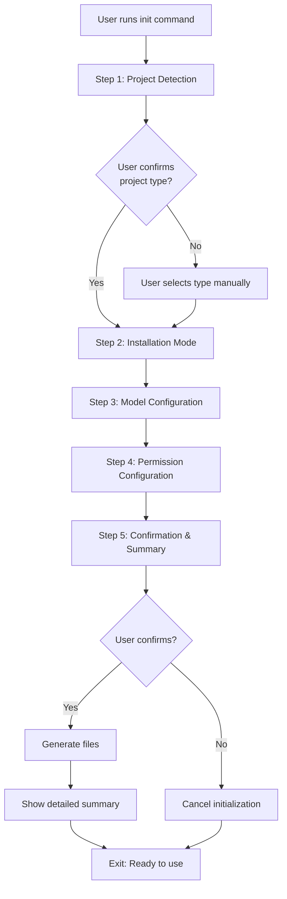

# Core Flows: User Journeys

## Overview

This spec documents the core user journeys for Atreides OpenCode, from initial installation through daily use. Each flow describes the user's entry point, step-by-step actions, system feedback, and exit points.

**Key Principles**:

- Simple, predictable interactions
- Clear feedback at every step
- Sensible defaults with customization options
- Forward-only wizard flow (Ctrl+C to restart)
- Preserve user customizations during updates

---

## Flow 1: First-Time Installation & Setup

**Description**: Developer discovers and installs Atreides OpenCode for the first time.

**Trigger**: User wants to add AI orchestration to their project.

### Steps

1. **Discovery**
  - User finds Atreides OpenCode via documentation, recommendation, or search
  - Reads about capabilities: structured workflows, agent delegation, safety guardrails
2. **Installation Decision**
  - User chooses installation method:
    - **Recommended**: `npx atreides-opencode init` (no global install)
    - **Alternative**: `npm install -g atreides-opencode` then `atreides init`
  - Documentation recommends npx approach for simplicity
3. **Navigate to Project**
  - User opens terminal in their project root directory
  - Ensures they're in the correct location (where they want Atreides configured)
4. **Run Initialization**
  - User executes: `npx atreides-opencode init`
  - System checks for OpenCode installation
  - If OpenCode not found: Shows message with installation docs link
  - If OpenCode found: Displays welcome message and begins wizard
  - Proceeds to **Flow 2: Project Initialization**
5. **Post-Setup**
  - After wizard completes, user sees detailed summary
  - Reviews created files and suggested next actions
  - Optionally runs `npx atreides-opencode doctor` to verify setup

**Exit Point**: User has working Atreides configuration, ready to use with OpenCode.

---

## Flow 2: Project Initialization (Interactive Wizard)

**Description**: Interactive wizard that configures Atreides for a project.

**Trigger**: User runs `npx atreides-opencode init` or `atreides init`.

### Wizard Flow Diagram



### Step-by-Step Flow

#### Step 1: Project Detection & Confirmation

**Display**:

```
🔍 Detecting project type...

Detected: TypeScript project
  Found: tsconfig.json, package.json
  Language: TypeScript
  Package Manager: npm

Is this correct? [Y/n]
```

**User Actions**:

- Press Enter or `Y` to confirm
- Press `n` to manually select project type

**If Detection Fails**:

```
⚠️  Could not detect project type
Defaulting to: Generic

Available types:
  1. Node.js
  2. TypeScript
  3. Python
  4. Go
  5. Rust
  6. Generic (no language-specific config)

Select project type [1-6]: _
```

**System Behavior**:

- Scans for: `package.json`, `tsconfig.json`, `pyproject.toml`, `go.mod`, `Cargo.toml`
- If multiple found, shows all and asks user to choose primary
- Stores selection for language-specific configurations later

---

#### Step 2: Installation Mode Selection

**Display**:

```
📦 Choose installation mode:

  ( ) Minimal
      AGENTS.md only - for existing projects with custom setup
      Files: AGENTS.md

  (•) Standard (recommended)
      Full configuration without agent delegation
      Files: AGENTS.md, opencode.json, .opencode/plugin/, .opencode/agent/

  ( ) Full
      Everything including agent delegation and all skills
      Files: All of the above + .opencode/skill/

Select mode [↑↓ arrows, Enter to confirm]: _
```

**User Actions**:

- Use arrow keys to navigate options
- Press Enter to select
- Each option shows what files will be created

**System Behavior**:

- Default selection: Standard
- Mode determines which files are generated
- All modes install all agents/skills, but Full mode enables delegation features

---

#### Step 3: Model Configuration

**Display**:

```
🤖 Configure AI models for agents

Each agent has a recommended model based on its purpose.
You can customize these based on your OpenCode model availability.

┌─────────────────────────────────────────────────────────────────┐
│ Agent: Stilgar (Oracle)                                          │
│ Purpose: Architecture decisions, complex debugging               │
│ Recommended: claude-sonnet-4 (Balanced performance/cost)         │
│ Model: [claude-sonnet-4 ▼]                                       │
└─────────────────────────────────────────────────────────────────┘

┌─────────────────────────────────────────────────────────────────┐
│ Agent: Explore                                                   │
│ Purpose: Fast codebase exploration                               │
│ Recommended: claude-haiku-4-5 (Fast, cost-effective)             │
│ Model: [claude-haiku-4-5 ▼]                                      │
└─────────────────────────────────────────────────────────────────┘

┌─────────────────────────────────────────────────────────────────┐
│ Agent: Librarian                                                 │
│ Purpose: Documentation and OSS research                          │
│ Recommended: claude-haiku-4-5 (Fast, cost-effective)             │
│ Model: [claude-haiku-4-5 ▼]                                      │
└─────────────────────────────────────────────────────────────────┘

... (continues for all 8 agents)

[Tab/Shift+Tab to navigate, Enter to change model, Ctrl+D when done]
```

**User Actions**:

- Tab through agents
- Press Enter on a model dropdown to see available options
- Select from OpenCode-available models
- Press Ctrl+D when satisfied with selections

**Model Dropdown Options**:

```
Select model for Stilgar:
  → claude-sonnet-4 (Recommended - Balanced)
    claude-opus-4 (Powerful - Higher cost)
    claude-haiku-4-5 (Fast - Lower cost)
    [Other OpenCode models...]
```

**System Behavior**:

- Shows all 8 agents (5 MVP + 3 post-MVP)
- Each agent displays: name, purpose, recommendation, dropdown
- Recommendations based on agent role (exploration = fast, architecture = powerful)
- Dropdown shows common models with performance notes
- Note: "Models configured here are defaults. Use OpenCode's model switcher (Ctrl+P) to change models during sessions."
- Defaults pre-selected based on recommendations

---

#### Step 4: Permission Configuration

**Display**:

```
🔐 Configure permissions

Select which operations Atreides can perform.
Recommendations based on TypeScript project.

File Operations:
  [✓] Read files
  [✓] Write files (with confirmation)
  [✓] Edit files (with confirmation)
  [ ] Delete files (requires explicit approval)

Shell Commands:
  [✓] npm commands (npm install, npm test, etc.)
  [✓] npx commands
  [✓] Node.js execution
  [ ] System commands (requires explicit approval)

Network Access:
  [✓] HTTP/HTTPS requests (for documentation, APIs)
  [ ] Unrestricted network access

Git Operations:
  [✓] Git status, diff, log (read-only)
  [✓] Git add, commit
  [ ] Git push (requires explicit approval)
  [ ] Git force operations (requires explicit approval)

[Space to toggle, Enter to continue]
```

**User Actions**:

- Use arrow keys to navigate
- Press Space to toggle checkboxes
- Press Enter when done

**System Behavior**:

- Pre-selects recommended permissions based on detected project type
- Maps UI categories to OpenCode permission schema:
  - File Operations → `read`, `edit` permissions
  - Shell Commands → `bash` permission with patterns
  - Network Access → `webfetch`, `websearch` permissions
  - Git Operations → `bash` permission with git-specific patterns
- TypeScript projects get `bash: { "npm *": "allow", "npx *": "allow", "node *": "allow" }`
- Python projects get `bash: { "pip *": "allow", "python *": "allow" }`
- Go projects get `bash: { "go *": "allow" }`
- Rust projects get `bash: { "cargo *": "allow" }`
- Dangerous operations default to `ask` or `deny`

---

#### Step 5: Confirmation & Summary

**Display**:

```
📋 Configuration Summary

Project Type: TypeScript
Installation Mode: Standard
Models Configured: 8 agents
Permissions: 12 enabled, 6 restricted

Files to be created:
  ✓ AGENTS.md (orchestration rules)
  ✓ opencode.json (OpenCode configuration)
  ✓ .opencode/plugin/atreides.ts (plugin entry point)
  ✓ .opencode/agent/stilgar.md
  ✓ .opencode/agent/explore.md
  ✓ .opencode/agent/librarian.md
  ✓ .opencode/agent/build.md
  ✓ .opencode/agent/plan.md
  ✓ .opencode/agent/frontend-ui-ux.md
  ✓ .opencode/agent/document-writer.md
  ✓ .opencode/agent/general.md

Proceed with initialization? [Y/n]: _
```

**User Actions**:

- Press Enter or `Y` to proceed
- Press `n` to cancel
- No back navigation - must Ctrl+C and restart to change answers

**System Behavior**:

- Shows complete summary of selections
- Lists all files that will be created
- Waits for final confirmation

---

#### Post-Wizard: Detailed Summary

**Display** (after successful generation):

```
✅ Atreides OpenCode initialized successfully!

📁 Created files:
   AGENTS.md                           (orchestration rules - customize here)
   opencode.json                       (OpenCode configuration)
   .opencode/plugin/atreides.ts        (plugin entry point)
   .opencode/agent/                    (8 agent definitions)
   .opencode/package.json              (plugin dependencies)

⚙️  Configuration:
   Project Type: TypeScript
   Installation Mode: Standard
   Agents: 8 configured (5 MVP, 3 extended)
   Models: Custom configuration applied
   Permissions: TypeScript-optimized preset

📖 Next steps:
   1. Review AGENTS.md to customize orchestration rules
   2. Run 'npx atreides-opencode doctor' to verify setup
   3. Start using OpenCode - Atreides will orchestrate automatically
   4. Edit opencode.json to adjust permissions as needed

📚 Documentation: https://atreides-opencode.dev/docs
💬 Support: https://github.com/atreides-opencode/issues

Happy coding! 🎉
```

**Exit Point**: User has complete Atreides setup, knows where files are, and what to do next.

---

### Re-initialization Behavior

**Scenario**: User runs `init` in directory with existing `.opencode/` or `AGENTS.md`.

**Display**:

```
⚠️  Existing Atreides configuration detected

Found:
  - AGENTS.md (modified 2 days ago)
  - opencode.json (modified 2 days ago)
  - .opencode/agent/ (8 files)

Merge mode: Update templates while preserving your customizations.

  - Template files will be updated to latest version
  - Your customizations in AGENTS.md will be preserved
  - Custom agent configurations will be merged
  - Backup created at: .opencode/.backup-2026-01-19/

Proceed with merge? [Y/n]: _
```

**System Behavior**:

- Detects existing files
- Creates backup in `.opencode/.backup-{timestamp}/`
- Updates template files to latest version
- **Preserves customizations**:
  - Custom rules in AGENTS.md (sections marked as custom or user-added)
  - Modified permissions in opencode.json (compares against defaults)
  - Changed model selections in agent files (compares against recommendations)
- Merges configurations: Template updates + user customizations
- Shows diff summary of changes

---

## Flow 3: Diagnostic & Troubleshooting (Doctor Command)

**Description**: User verifies installation correctness and diagnoses issues.

**Trigger**: User runs `npx atreides-opencode doctor` or `atreides doctor`.

### Steps

1. **Run Doctor Command**
  - User executes: `npx atreides-opencode doctor`
  - System begins diagnostic checks
2. **Traffic Light Summary**

**Display**:

```
🏥 Atreides OpenCode Diagnostics

Overall Status: 🟢 HEALTHY

━━━━━━━━━━━━━━━━━━━━━━━━━━━━━━━━━━━━━━━━━━━━━━━━━━━━━━━━━━━━━

📦 Plugin System                                              🟢 PASS
   ✓ Plugin entry point exists
   ✓ Plugin loads without errors
   ✓ OpenCode integration verified

🤖 Agents                                                     🟢 PASS
   ✓ 8 agents configured
   ✓ All agent files valid
   ✓ Model configurations correct

🎯 Skills                                                     🟡 WARNING
   ✓ 4 MVP skills configured
   ⚠ 8 post-MVP skills available but not enabled
   → Run with --full mode to enable all skills

⚙️  Configuration                                             🟢 PASS
   ✓ AGENTS.md syntax valid
   ✓ opencode.json schema valid
   ✓ Permissions configured correctly

🔐 Security                                                   🟢 PASS
   ✓ Blocked patterns configured
   ✓ File guards active
   ✓ Command validation enabled

━━━━━━━━━━━━━━━━━━━━━━━━━━━━━━━━━━━━━━━━━━━━━━━━━━━━━━━━━━━━━

Run 'atreides doctor --verbose' for detailed breakdown.
```

**Traffic Light Meanings**:

- 🟢 **GREEN (HEALTHY)**: All checks passed, system ready
- 🟡 **YELLOW (WARNING)**: System functional, but has recommendations or non-critical issues
- 🔴 **RED (ERROR)**: Critical issues found, system may not work correctly

**Overall Status Logic** (weighted by category importance):

- Core categories (Plugin System, Configuration): Errors here → RED overall
- Important categories (Agents, Security): Errors here → YELLOW overall (if core is green)
- Optional categories (Skills): Warnings here → GREEN overall (if core/important are green)
- Any RED in core → Overall RED
- Any YELLOW in important (with core GREEN) → Overall YELLOW
- All GREEN → Overall GREEN

1. **Detailed Breakdown** (if issues found or `--verbose` flag)

**Display** (example with errors):

```
🏥 Atreides OpenCode Diagnostics (Detailed)

━━━━━━━━━━━━━━━━━━━━━━━━━━━━━━━━━━━━━━━━━━━━━━━━━━━━━━━━━━━━━

📦 Plugin System                                              🔴 ERROR

   ✗ Plugin entry point missing
     Expected: .opencode/plugin/atreides.ts
     Fix: Run 'atreides init' to regenerate plugin files

   ✓ OpenCode integration verified

🤖 Agents                                                     🟡 WARNING

   ✓ 8 agents configured
   
   ⚠ Agent 'stilgar' using deprecated model
     Current: claude-2.1
     Recommended: claude-sonnet-4
     Fix: Edit .opencode/agent/stilgar.md, update model field

   ✓ All agent files valid

⚙️  Configuration                                             🟢 PASS

   ✓ AGENTS.md syntax valid
   ✓ opencode.json schema valid
   ✓ Permissions configured correctly

━━━━━━━━━━━━━━━━━━━━━━━━━━━━━━━━━━━━━━━━━━━━━━━━━━━━━━━━━━━━━

Summary: 1 error, 1 warning, 8 checks passed

Next steps:
  1. Fix critical error: Regenerate plugin files
  2. Address warning: Update stilgar model
  3. Re-run 'atreides doctor' to verify fixes
```

**System Behavior**:

- Runs all diagnostic checks
- Shows overall status first (traffic light)
- Groups checks by category
- For each issue, shows:
  - What's wrong
  - Why it matters
  - How to fix it
- Provides actionable next steps

**Exit Point**: User understands system health and knows how to fix any issues.

---

## Flow 4: Version Updates

**Description**: User updates to a newer version of Atreides OpenCode.

**Trigger**: New version released, user wants latest features/fixes.

### Steps

1. **Check for Updates**
  - User runs: `npx atreides-opencode update`
  - Or: `npm update atreides-opencode` (if globally installed)
2. **Smart Update Process**

**Display**:

```
🔄 Checking for updates...

Current version: 1.2.0
Latest version: 1.3.0

Changelog highlights:
  • New agent: Performance Optimizer
  • Enhanced security: Additional blocked patterns
  • Bug fix: Model configuration persistence
  • Template updates: Improved AGENTS.md structure

Update available! Proceed? [Y/n]: _
```

1. **Update Execution**

**Display** (during update):

```
📦 Updating atreides-opencode...

✓ Package updated: 1.2.0 → 1.3.0
✓ Backup created: .opencode/.backup-2026-01-19-143022/

Syncing templates...
  ✓ .opencode/plugin/atreides.ts (updated)
  ✓ .opencode/agent/stilgar.md (updated)
  ⊙ AGENTS.md (preserved - contains customizations)
  ✓ opencode.json (merged - new permissions added)

Customizations preserved:
  • AGENTS.md: Custom orchestration rules kept
  • Agent configs: Your model selections maintained
  • Permissions: Existing settings merged with new options

✅ Update complete!

Run 'atreides doctor' to verify updated installation.
```

**System Behavior**:

- Checks npm registry for latest version
- Shows changelog/release notes
- Creates backup before updating
- Updates package via npm
- Syncs template files to latest version
- **Preserves customizations** (same as re-initialization):
  - Custom rules in AGENTS.md (user-added sections)
  - Modified permissions in opencode.json (non-default values)
  - Changed model selections (non-recommended models)
  - Persona name (if customized)
- Merges new features with existing config
- Shows clear summary of what changed

**Exit Point**: User has latest version with customizations intact.

---

## Flow 5: Configuration Customization (Manual Editing)

**Description**: User modifies Atreides configuration after initial setup.

**Trigger**: User wants to adjust agents, models, permissions, or orchestration rules.

### Steps

1. **Identify What to Change**
  - User determines what needs customization:
    - Orchestration rules → Edit `AGENTS.md`
    - Permissions → Edit `opencode.json`
    - Agent models → Edit `.opencode/agent/{agent-name}.md`
    - Persona name → Edit `opencode.json` or plugin config
2. **Edit Configuration Files**

**AGENTS.md** (orchestration rules):

```markdown
# Atreides Orchestration Rules

## Custom Rules

### My Project-Specific Rule
When working on authentication features, always consult the Security Engineer agent.

### Code Review Protocol
Before committing changes:
1. Run quality checks
2. Verify tests pass
3. Update documentation

... (user adds custom rules)
```

**opencode.json** (permissions):

```json
{
  "permissions": {
    "bash": {
      "allow": ["npm *", "npx *", "node *"],
      "deny": ["rm -rf /", "sudo *"]
    },
    "file": {
      "allow": ["**/*.ts", "**/*.md"],
      "deny": [".env", "**/*.key"]
    }
  },
  "atreides": {
    "personaName": "Atreides",
    "responsePrefix": true
  }
}
```

**Agent Configuration** (`.opencode/agent/stilgar.md`):

```markdown
---
name: stilgar
displayName: Stilgar
model: claude-opus-4
description: Architecture decisions and complex debugging
---

# Stilgar (Oracle Agent)

... (agent definition)
```

1. **Verify Changes**
  - User saves files
  - Optionally runs: `npx atreides-opencode doctor`
  - Doctor validates syntax and configuration
2. **Changes Take Effect**
  - OpenCode automatically reloads configuration
  - Changes apply to next AI session
  - No restart required

**System Behavior**:

- Configuration files are plain text (Markdown, JSON)
- Changes detected automatically by OpenCode
- Invalid syntax caught by doctor command
- No special tools needed - any text editor works

**Exit Point**: User has customized Atreides to their workflow.

---

## Navigation & Error Handling

### Wizard Navigation

- **Forward-only**: No back button, Ctrl+C to restart
- **Keyboard-driven**: Arrow keys, Enter, Space, Tab
- **Clear prompts**: Each step shows available actions
- **Progress indication**: Step numbers (1/5, 2/5, etc.)

### Error Handling

**Invalid Input**:

```
⚠️  Invalid selection. Please choose 1-6.
Select project type [1-6]: _
```

**Permission Denied**:

```
❌ Error: Cannot write to directory
   Permission denied: /path/to/project

Fix: Run with appropriate permissions or choose different directory.
```

**Interrupted Wizard**:

```
^C
⚠️  Initialization cancelled.
   No files were created.
   Run 'atreides init' to start over.
```

### Feedback Patterns

- ✓ Success (green checkmark)
- ✗ Error (red X)
- ⚠ Warning (yellow warning)
- ⊙ Skipped/Preserved (circle)
- 🔍 Detecting/Scanning
- 📦 Installing/Creating
- 🔄 Updating
- 🏥 Diagnosing

---

## Summary

These core flows cover the complete user journey:

1. **Installation & Setup**: From discovery to working configuration
2. **Interactive Wizard**: Step-by-step guided setup with smart defaults
3. **Diagnostics**: Health checks and troubleshooting
4. **Updates**: Version management with customization preservation
5. **Customization**: Manual editing for power users

**Key UX Principles**:

- Simple entry points (npx recommended)
- Clear feedback at every step
- Sensible defaults, easy customization
- Preserve user work during updates
- Actionable error messages
- No hidden complexity

