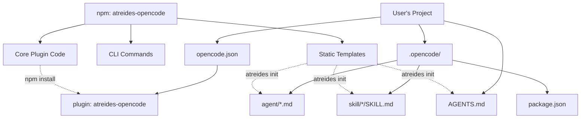
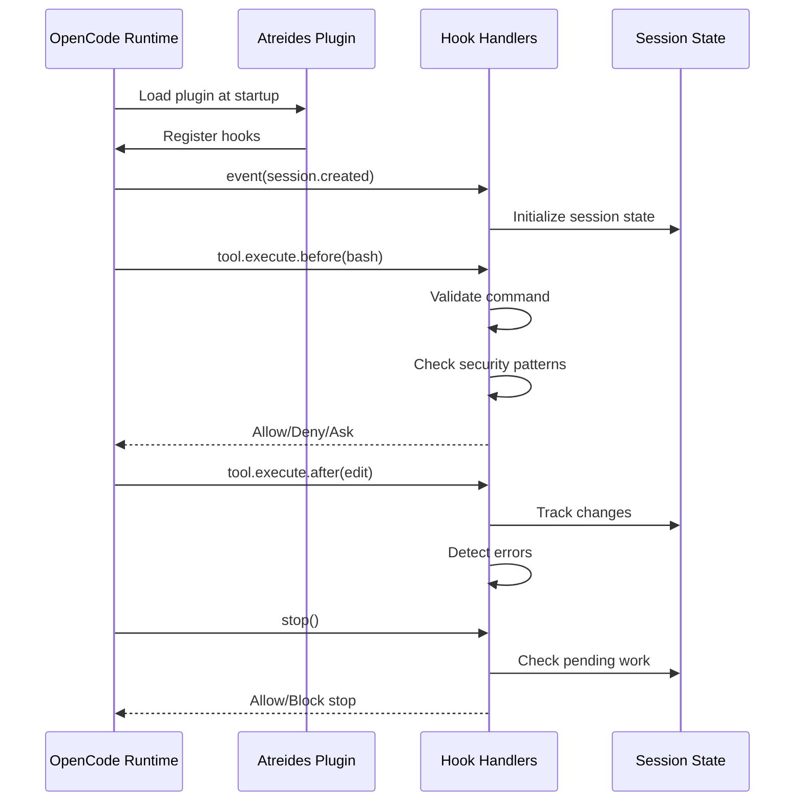
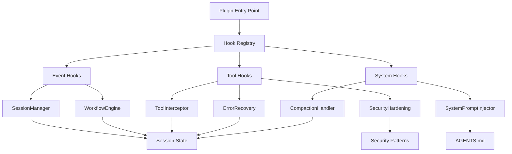
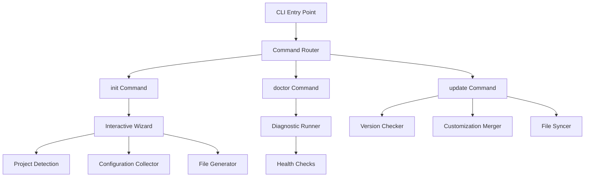
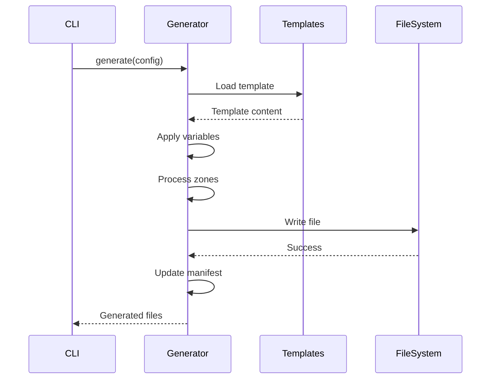
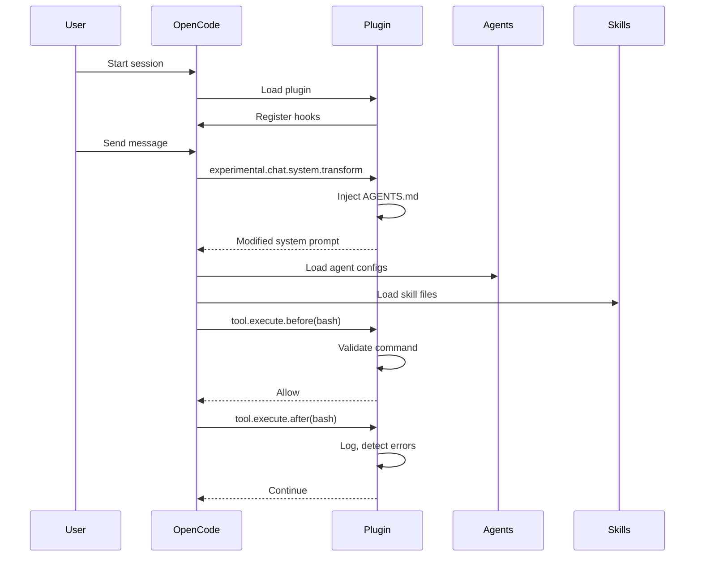

# Technical Plan: Atreides OpenCode Architecture

## Overview

This technical plan defines the architecture for Atreides OpenCode, an AI orchestration plugin for OpenCode that provides structured workflows, agent delegation, error recovery, and security hardening. The implementation leverages OpenCode's plugin system, hooks, and agent/skill infrastructure to deliver a comprehensive orchestration layer.

**References**:

- Epic Brief: spec:bf063507-9358-4515-afbb-3080f2099467/0e560899-f975-48a0-9789-b74c9531a6a4
- Core Flows: spec:bf063507-9358-4515-afbb-3080f2099467/f32d7c5a-99f4-4e9f-99f3-c04d552db8c7
- Master Plan: file:ATREIDES_OC_MASTER_PLAN.md
- Deep Dive Findings: file:archive/ATREIDES_DEEP_DIVE_FINDINGS.md

---

## 1. Architectural Approach

### 1.1 Distribution Model

**Decision**: Hybrid npm package + local file generation



**Rationale**:

- **npm package** provides core plugin logic, CLI, and templates
- **Local files** (AGENTS.md, agents, skills) are user-customizable
- **Clean separation**: Immutable core (npm) vs mutable customizations (local)
- **Update strategy**: `npm update` updates core, preserves local customizations
- **Follows OpenCode standards**: Similar to Oh My Opencode pattern

**Trade-offs**:

- ✅ Easy updates via npm
- ✅ User customizations preserved
- ✅ Standard distribution model
- ⚠️ Requires diff-based merge during updates
- ⚠️ Two sources of truth (npm + local)

### 1.2 Plugin Architecture

**Decision**: Event-driven hook-based architecture using OpenCode's plugin system



**Core Principles**:

1. **Hook-based**: All functionality implemented via OpenCode hooks
2. **Stateless hooks**: Hooks are pure functions, state managed separately
3. **Fail-safe**: Hooks never throw, always return valid responses (enforced via try-catch + validation + error boundaries)
4. **Performance**: <20ms overhead per hook call (target, relaxed for comprehensive security)
5. **Sequential execution**: Assume OpenCode calls hooks sequentially (rely on platform guarantees)

**Hook Strategy**:


| Hook                                 | Purpose                  | Priority | Fallback         |
| ------------------------------------ | ------------------------ | -------- | ---------------- |
| `event` (session.created/deleted)    | Session lifecycle        | MVP      | N/A (stable)     |
| `stop`                               | Workflow enforcement     | MVP      | N/A (stable)     |
| `tool.execute.before`                | Security validation      | MVP      | N/A (stable)     |
| `tool.execute.after`                 | Logging, error detection | MVP      | N/A (stable)     |
| `experimental.chat.system.transform` | Inject AGENTS.md rules   | MVP      | Static injection |
| `experimental.session.compacting`    | Preserve critical state  | MVP      | Log warning      |


**Experimental Hook Handling**:

- MVP assumes experimental hooks are stable
- Post-MVP: Add fallback detection and graceful degradation
- Monitor OpenCode changelog for API changes

### 1.3 State Management

**Decision**: In-memory Map keyed by session ID (OpenCode standard pattern)

**State Storage Pattern**:

```typescript
// Plugin-level state map
const sessions = new Map<string, SessionState>()

// Get or initialize state
function getState(sessionId: string): SessionState {
  let state = sessions.get(sessionId)
  if (!state) {
    state = initializeSessionState(sessionId)
    sessions.set(sessionId, state)
  }
  return state
}

// Cleanup on session deletion
event(session.deleted) => sessions.delete(sessionId)
```

**State Categories**:

1. **Session State** (per-session, in-memory):
  - Current workflow phase
  - Error strike counter
  - Pending todos
  - Tool call history
  - Stored in `Map<string, SessionState>`
2. **Configuration** (persistent, file-based):
  - User preferences (persona name, etc.)
  - Stored in `opencode.json`
  - Loaded at plugin initialization

**Trade-offs**:

- ✅ Standard OpenCode pattern (verified from plugin examples)
- ✅ Simple, no external dependencies
- ✅ Automatic cleanup on session deletion
- ⚠️ State lost on plugin reload or OpenCode restart
- ⚠️ No persistence across sessions (acceptable for orchestration state)

### 1.4 Configuration Hierarchy

**Decision**: Multi-layer configuration with clear precedence

```
┌─────────────────────────────────────────────────────────────┐
│                    Configuration Layers                      │
├─────────────────────────────────────────────────────────────┤
│                                                              │
│  1. Plugin Defaults (npm package)                            │
│     └─ Hardcoded defaults, security patterns                │
│                                                              │
│  2. opencode.json (Project config)                           │
│     └─ Permissions, plugin settings                         │
│                                                              │
│  3. AGENTS.md (Orchestration rules)                          │
│     └─ User-customizable AI instructions                    │
│                                                              │
│  4. Agent Files (.opencode/agent/*.md)                       │
│     └─ Agent-specific configs, model selections             │
│                                                              │
│  5. Skill Files (.opencode/skill/*/SKILL.md)                │
│     └─ Skill definitions, context types                     │
│                                                              │
└─────────────────────────────────────────────────────────────┘

Precedence: 5 > 4 > 3 > 2 > 1 (higher number wins)
```

**Simplified to 3 Layers**:

1. **Plugin Defaults** (npm package, hardcoded)
  - Security patterns, blocked files
  - Default workflow phases
  - Core orchestration logic
2. **opencode.json** (project config, user-editable)
  - Permissions (OpenCode's permission system)
  - Plugin settings (identity, workflow, security toggles)
  - Agent model selections
  - Skill enablement
3. **AGENTS.md** (AI instructions only, user-editable)
  - Orchestration rules for AI
  - Custom workflow guidance
  - Project-specific instructions
  - Injected via `experimental.chat.system.transform`

**Interaction Model**:

- **Plugin code**: Enforces core behavior (security, workflow) via hooks
- **opencode.json**: All configuration (permissions, settings, agents, skills)
- **AGENTS.md**: AI instructions only (no configuration)
- **Agent/Skill files**: Loaded by OpenCode, configured via opencode.json

**Conflict Resolution**:

- Security rules: Plugin enforces, cannot be overridden
- Configuration: opencode.json controls, plugin validates
- AI instructions: AGENTS.md provides, plugin injects

### 1.5 Security Architecture

**Decision**: Defense-in-depth with multiple validation layers

**Security Layers**:

1. **Command Obfuscation Detection**:
  - URL decode (`%XX`)
  - Hex escapes (`\xNN`)
  - Octal escapes (`\NNN`)
  - Quote stripping (`r'm'` → `rm`)
  - Backslash continuations
2. **Blocked Pattern Matching**:
  - Dangerous commands: `rm -rf /`, `mkfs`, fork bomb, `curl|bash`
  - Warning patterns: `sudo`, `chmod`, `git push --force`
3. **File Operation Guards**:
  - Blocked files: `.env*`, `secrets.*`, `*.pem`, `*.key`, `id_rsa`
  - Blocked paths: `.ssh/*`, `.aws/*`, `.npmrc`, `kubeconfig`
4. **Log Sanitization**:
  - Control character removal
  - Length limits (500 chars)
  - Injection prevention
5. **Error Pattern Detection**:
  - 22 error patterns (command not found, permission denied, etc.)
  - Automatic error recovery triggering

**Implementation**: All security logic in `tool.execute.before` hook

**Implementation**: All security logic in `tool.execute.before` hook

**Error Handling**:

- All validation wrapped in try-catch blocks
- Errors logged but never thrown
- Invalid input defaults to "deny" (safe default)
- Validation failures return clear error messages

**Trade-offs**:

- ✅ Multiple layers of protection
- ✅ Comprehensive pattern coverage
- ✅ Centralized in plugin (not user-modifiable)
- ⚠️ Performance overhead (~15-20ms per validation, within relaxed target)
- ⚠️ May block legitimate edge cases (users can override via opencode.json)

### 1.6 Build & Distribution Strategy

**Decision**: TypeScript compiled to JavaScript, distributed via npm

**Build Pipeline**:

```
Source (TypeScript) → Compile (tsc/bun) → Bundle (optional) → Publish (npm)
```

**Package Structure**:

```
atreides-opencode/
├── dist/                    # Compiled output
│   ├── plugin/
│   │   └── index.js        # Plugin entry point
│   ├── cli/
│   │   └── index.js        # CLI entry point
│   └── lib/                # Shared utilities
├── templates/              # Static templates
│   ├── agents/
│   ├── skills/
│   └── AGENTS.md.template
├── package.json
│   ├── "main": "dist/plugin/index.js"
│   ├── "bin": { "atreides-opencode": "dist/cli/index.js" }
│   ├── "type": "module"
│   └── "exports": { ... }
└── tsconfig.json
```

**Development Tools**:

- **Bun**: Development runtime, testing, fast builds
- **TypeScript**: Type safety, IDE support
- **npm**: Distribution, version management

**Trade-offs**:

- ✅ Standard npm distribution
- ✅ TypeScript type safety
- ✅ Fast development with Bun
- ✅ No heavy bundling needed
- ⚠️ Requires build step
- ⚠️ Bun dependency for development

---

## 2. Data Model

### 2.1 Session State Schema

**Purpose**: Track session-scoped orchestration state

```typescript
interface SessionState {
  // Session metadata
  sessionId: string
  createdAt: number
  lastActivity: number
  
  // Workflow tracking
  workflow: {
    currentPhase: WorkflowPhase  // Intent | Assessment | Exploration | Implementation | Verification
    phaseHistory: PhaseTransition[]
    intentClassification?: string
  }
  
  // Error recovery
  errorRecovery: {
    strikeCount: number
    lastError?: {
      timestamp: number
      tool: string
      error: string
    }
    escalated: boolean
  }
  
  // Todo tracking
  todos: {
    created: TodoItem[]
    completed: TodoItem[]
    pending: TodoItem[]
  }
  
  // Tool call history (for context)
  toolHistory: ToolCall[]
  
  // Custom state (extensible)
  custom: Record<string, unknown>
}

type WorkflowPhase = 'intent' | 'assessment' | 'exploration' | 'implementation' | 'verification'

interface PhaseTransition {
  from: WorkflowPhase
  to: WorkflowPhase
  timestamp: number
  reason?: string
}

interface TodoItem {
  id: string
  description: string
  createdAt: number
  completedAt?: number
}

interface ToolCall {
  tool: string
  timestamp: number
  success: boolean
  error?: string
}
```

**Storage**: In-memory Map keyed by session ID

```typescript
const sessions = new Map<string, SessionState>()

function getState(sessionId: string): SessionState {
  let state = sessions.get(sessionId)
  if (!state) {
    state = {
      sessionId,
      createdAt: Date.now(),
      lastActivity: Date.now(),
      workflow: { currentPhase: 'intent', phaseHistory: [] },
      errorRecovery: { strikeCount: 0, escalated: false },
      todos: { created: [], completed: [], pending: [] },
      toolHistory: [],
      custom: {}
    }
    sessions.set(sessionId, state)
  }
  return state
}
```

**Lifecycle**:

- Created: `event(session.created)` → `sessions.set(sessionId, initialState)`
- Updated: After each hook call → `getState(sessionId)` then modify
- Deleted: `event(session.deleted)` → `sessions.delete(sessionId)`

**Persistence**: State is in-memory only, lost on plugin reload. This is acceptable for orchestration state (workflow phase, strike counter) which is session-scoped.

### 2.2 Configuration Schema

**Purpose**: Define user-customizable settings

```typescript
interface AtreidesConfig {
  // Identity system
  identity: {
    personaName: string          // Default: "Muad'Dib"
    responsePrefix: boolean      // Default: true
    delegationAnnouncements: boolean  // Default: true
  }
  
  // Workflow settings
  workflow: {
    enablePhaseTracking: boolean
    strictTodoEnforcement: boolean
    autoEscalateOnError: boolean
  }
  
  // Security settings
  security: {
    enableObfuscationDetection: boolean
    blockedPatterns: string[]
    warningPatterns: string[]
    blockedFiles: string[]
  }
  
  // Agent settings
  agents: {
    [agentName: string]: {
      model: string
      displayName: string
      enabled: boolean
    }
  }
  
  // Skill settings
  skills: {
    [skillName: string]: {
      enabled: boolean
      contextType: 'main' | 'fork'
    }
  }
}
```

**Storage**: 

- Defaults: Plugin code
- Overrides: `opencode.json` under `atreides` key
- Runtime: Merged in-memory

### 2.3 Customization Tracking

**Purpose**: Track user modifications for diff-based merge during updates

```typescript
interface CustomizationManifest {
  version: string  // Template version used
  
  files: {
    [filepath: string]: {
      templateHash: string      // Hash of original template
      currentHash: string       // Hash of current file
      customized: boolean       // true if hashes differ
      lastModified: number
    }
  }
  
  // Specific customizations
  customizations: {
    agentsmd: {
      customSections: string[]  // User-added section headers
      modifiedSections: string[]
    }
    
    agents: {
      [agentName: string]: {
        modelChanged: boolean
        customFields: string[]
      }
    }
    
    permissions: {
      addedRules: string[]
      modifiedRules: string[]
    }
  }
}
```

**Storage**: `.opencode/.atreides-manifest.json`

**Usage**:

- Generated during `atreides init`
- Updated during `atreides update`
- Used for diff-based merge algorithm

### 2.4 Template Metadata

**Purpose**: Define template structure for generation and updates

```typescript
interface TemplateMetadata {
  name: string
  version: string
  type: 'agent' | 'skill' | 'config' | 'orchestration'
  
  // Template variables
  variables: {
    [key: string]: {
      type: 'string' | 'boolean' | 'array'
      default?: unknown
      required: boolean
      description: string
    }
  }
  
  // Customization zones
  customizationZones: {
    [zoneName: string]: {
      startMarker: string
      endMarker: string
      preserveOnUpdate: boolean
    }
  }
}
```

**Example**:

```typescript
{
  name: "stilgar-agent",
  version: "1.0.0",
  type: "agent",
  variables: {
    model: { type: "string", default: "claude-sonnet-4", required: true },
    displayName: { type: "string", default: "Stilgar", required: true }
  },
  customizationZones: {
    customRules: {
      startMarker: "<!-- CUSTOM RULES START -->",
      endMarker: "<!-- CUSTOM RULES END -->",
      preserveOnUpdate: true
    }
  }
}
```

---

## 3. Component Architecture

### 3.1 Plugin Core Components

**Overview**: The plugin core implements all orchestration logic via OpenCode hooks



**Component Responsibilities**:

#### 3.1.1 SessionManager

- **Purpose**: Manage session lifecycle and state
- **Hooks**: `event(session.created)`, `event(session.deleted)`
- **Responsibilities**:
  - Initialize session state on creation (via Map.set)
  - Clean up state on deletion (via Map.delete)
  - Provide state access API (`getState(sessionId)`)
  - Track session metadata
  - Maintain in-memory Map of all active sessions

#### 3.1.2 WorkflowEngine

- **Purpose**: Track and enforce workflow phases
- **Hooks**: `tool.execute.after`, `stop`
- **Responsibilities**:
  - Classify user intent
  - Track current workflow phase
  - Enforce phase transitions
  - Provide phase-specific guidance

#### 3.1.3 ToolInterceptor

- **Purpose**: Validate and log tool calls
- **Hooks**: `tool.execute.before`, `tool.execute.after`
- **Responsibilities**:
  - Pre-execution validation
  - Security checks (delegates to SecurityHardening)
  - Post-execution logging
  - Tool call history tracking

#### 3.1.4 SecurityHardening

- **Purpose**: Implement security validation
- **Hooks**: Called by ToolInterceptor
- **Responsibilities**:
  - Command obfuscation detection
  - Blocked pattern matching
  - File operation guards
  - Log sanitization

#### 3.1.5 ErrorRecovery

- **Purpose**: Detect and recover from errors
- **Hooks**: `tool.execute.after`
- **Responsibilities**:
  - Error pattern detection
  - Strike counter management
  - Escalation to Oracle agent
  - Recovery suggestions

#### 3.1.6 SystemPromptInjector

- **Purpose**: Inject AGENTS.md into system prompt
- **Hooks**: `experimental.chat.system.transform`
- **Responsibilities**:
  - Read AGENTS.md from file system
  - Validate syntax (fail gracefully if invalid)
  - Inject orchestration rules into system prompt
  - Add identity formatting (persona name, response prefix)
  - Merge with existing system prompt
  - Use default rules if AGENTS.md is invalid (show warning in AI response)
  - Cache validated AGENTS.md, watch file for changes

#### 3.1.7 CompactionHandler

- **Purpose**: Preserve critical state during compaction
- **Hooks**: `experimental.session.compacting`
- **Responsibilities**:
  - Serialize critical state
  - Preserve todo list
  - Preserve workflow phase
  - Inject into compacted context

#### 3.1.8 TodoEnforcer

- **Purpose**: Track and enforce todo completion
- **Hooks**: `stop`, `tool.execute.after`
- **Responsibilities**:
  - Detect todo creation
  - Track completion
  - Block stop if pending todos
  - Provide todo status

#### 3.1.9 IdentityManager

- **Purpose**: Manage agent identity and branding
- **Hooks**: Called by SystemPromptInjector
- **Responsibilities**:
  - Format response prefixes
  - Generate delegation announcements
  - Apply persona name
  - Maintain display name mappings

#### 3.1.10 ProjectDetection

- **Purpose**: Detect project type and language
- **Hooks**: Used by CLI, not runtime hooks
- **Responsibilities**:
  - Scan for project files
  - Detect language/framework
  - Determine maturity level
  - Generate language-specific configs

### 3.2 CLI Components

**Overview**: CLI provides user-facing commands for setup and maintenance



**Component Responsibilities**:

#### 3.2.1 init Command

- **Purpose**: Interactive onboarding wizard
- **Steps**:
  1. Check OpenCode installation
  2. Detect project type
  3. Collect configuration (mode, models, permissions)
  4. Generate files (opencode.json, AGENTS.md, agents, skills)
  5. Run `bun install` in `.opencode/`
  6. Show summary and next steps

#### 3.2.2 doctor Command

- **Purpose**: Verify installation and diagnose issues
- **Checks**:
  - OpenCode installation
  - Plugin loading
  - Agent files validity
  - Skill files validity
  - Configuration syntax
  - Security patterns
- **Output**: Traffic light summary + detailed breakdown

#### 3.2.3 update Command

- **Purpose**: Update to latest version while preserving customizations
- **Steps**:
  1. Check npm for latest version
  2. Update npm package
  3. Load customization manifest
  4. Diff current files against templates
  5. Merge updates with customizations
  6. Update manifest
  7. Show summary of changes

### 3.3 File Generation System

**Overview**: Generate project files from templates with user configuration



**Template Processing**:

1. Load template from `templates/` directory
2. Replace variables with user config
3. Process customization zones
4. Write to target location
5. Update customization manifest

**Template Types**:

- **Static**: Copied as-is (e.g., skill files)
- **Variable**: Variables replaced (e.g., agent files with model selection)
- **Hybrid**: Base content + customization zones (e.g., AGENTS.md)

### 3.4 Integration Points

**OpenCode Integration**:



**Key Integration Points**:

1. **Plugin Loading**:
  - OpenCode reads `opencode.json`
  - Loads plugin from npm cache
  - Calls plugin function with context
  - Registers returned hooks
2. **Agent Loading**:
  - OpenCode scans `.opencode/agent/`
  - Parses agent markdown files
  - Applies model and permission configs
  - Makes agents available for delegation
3. **Skill Loading**:
  - OpenCode scans `.opencode/skill/`
  - Parses SKILL.md files
  - Determines context type (main/fork)
  - Makes skills available for use
4. **Configuration Merging**:
  - OpenCode merges configs in precedence order
  - Plugin reads merged config
  - Applies runtime overrides
  - Enforces security constraints

### 3.5 Update & Merge Strategy

**Diff-Based Merge Algorithm**:

```
For each file to update:
  1. Load current file
  2. Load original template (from manifest)
  3. Load new template (from npm package)
  4. Compute diff: current vs original
  5. If diff is empty:
     → Replace with new template (no customizations)
  6. If diff exists:
     → Three-way merge: original + diff + new template
     → Preserve customization zones
     → Merge non-conflicting changes
  7. Update manifest with new template hash
  8. Write merged file
```

**Customization Preservation** (Structural Detection):

1. **AGENTS.md**:
  - Parse markdown AST (sections, headings, lists)
  - Detect user-added sections (not in template structure)
  - Detect modified sections (content differs from template)
  - Preserve user additions and modifications
  - Update unchanged template sections
2. **opencode.json**:
  - Deep object comparison against defaults
  - Preserve modified values (permissions, settings)
  - Merge new fields from template
  - Preserve custom fields not in template
3. **Agent/Skill Files**:
  - Hash-based detection (compare against manifest)
  - If hash differs → preserve entire file, create .new with template
  - If hash matches → replace with new template
  - User can manually merge .new if desired

**No Markers Required**: Structural detection eliminates need for `<!-- CUSTOM START -->` markers

**Conflict Resolution**:

**Interactive Resolution** (when conflicts detected):

```
⚠️  Merge conflict detected in AGENTS.md

Conflict in section: "Workflow Phases"

Your version (modified 2 days ago):
  > Custom phase: Code Review
  > - Run linters
  > - Check test coverage

New template version:
  > Phase: Verification
  > - Run quality checks
  > - Validate implementation

Choose resolution:
  1. Keep your version (preserve customization)
  2. Use new template (get latest updates)
  3. Merge manually (open editor)
  4. Skip this file (resolve later)

Select [1-4]: _
```

**Resolution Strategy**:

- **Automatic**: Non-conflicting changes merged silently
- **Interactive**: Conflicts prompt user for choice
- **Backup**: Original file backed up to `.opencode/.backup-{timestamp}/`
- **Structural merge**: Use markdown AST parsing to detect section-level changes
- **Fallback**: If structural merge fails, create .conflict file with git-style markers

---

## 4. Testing Strategy

### 4.1 Test Categories

**Unit Tests** (Business Logic):

- Security pattern matching
- Obfuscation detection
- Error pattern detection
- Configuration merging
- State management
- Template processing

**Integration Tests** (Hook Execution):

- Hook registration
- Event handling
- Tool interception
- System prompt injection
- Session lifecycle

**End-to-End Tests** (Full Workflow):

- Init wizard flow
- Doctor diagnostics
- Update with customizations
- Complete AI session with orchestration

### 4.2 Test Infrastructure

**Mock Strategy**:

- Mock OpenCode context for unit tests
- Use test fixtures for templates
- Mock file system for CLI tests
- Use in-memory state for session tests

**Integration Test Setup**:

- Require OpenCode installation
- Use test project directory
- Clean state between tests
- Verify actual hook execution

**Target Coverage**:

- > 80% code coverage
- 100% security pattern coverage
- All critical paths tested
- 466 tests total (matching Atreides)

---

## 5. Performance Targets


| Metric                   | Target | Measurement                                       |
| ------------------------ | ------ | ------------------------------------------------- |
| Plugin load time         | <100ms | Startup benchmark                                 |
| Hook overhead (per call) | <20ms  | Hook execution timing (relaxed for security)      |
| CLI init time            | <2s    | End-to-end timing                                 |
| Doctor command           | <1s    | End-to-end timing                                 |
| Security validation      | <15ms  | Pattern matching benchmark (comprehensive checks) |
| Template generation      | <500ms | File generation timing                            |
| AGENTS.md validation     | <50ms  | Syntax checking + parsing                         |


**Optimization Strategies**:

- Cache security patterns (compile once)
- Lazy-load templates
- Minimize file I/O
- Use efficient data structures
- Profile and optimize hot paths

---

## 6. Constraints & Assumptions

### 6.1 Technical Constraints

- **OpenCode Version**: Requires OpenCode with plugin support
- **Bun Runtime**: Development requires Bun for fast builds
- **Node.js**: Runtime requires Node.js 20+ or Bun
- **TypeScript**: Source code in TypeScript, compiled to JavaScript
- **Experimental Hooks**: MVP assumes `experimental.*` hooks are stable

### 6.2 Assumptions

- OpenCode's plugin loading follows documented behavior (verified)
- Session state managed via Map pattern (verified from plugin examples)
- Agent and skill files are loaded by OpenCode automatically from `.opencode/agent/` and `.opencode/skill/`
- Permission system works as documented (verified)
- Model selection via OpenCode's UI (Ctrl+P) is sufficient
- Hooks are called sequentially by OpenCode (not concurrently)
- Updates require OpenCode restart to take effect (documented in update flow)

### 6.3 Dependencies

**Runtime Dependencies**:

- OpenCode (peer dependency)
- Minimal npm dependencies (prefer built-ins)

**Development Dependencies**:

- Bun (build and test)
- TypeScript (compilation)
- Testing framework (Bun's built-in test runner)

---

## 7. Validation & Refinements

This technical plan has been stress-tested and refined based on architecture validation:

**Confirmed Decisions**:

- ✅ npm + local distribution model
- ✅ TypeScript implementation
- ✅ Hook-based architecture
- ✅ 8 agents, 12 skills
- ✅ Security hardening (obfuscation, patterns, guards)
- ✅ Identity system (persona, prefixes, announcements)

**Validated & Refined**:

- ✅ Session state: In-memory Map pattern (verified from OpenCode plugin examples)
- ✅ Plugin loading: npm package + optional local wrapper (OpenCode standard)
- ✅ Template generation: Hybrid with structural detection (no markers needed)
- ✅ Configuration: Simplified to 3 layers (Plugin, opencode.json, AGENTS.md)
- ✅ Customization merge: Structural merge with interactive conflict resolution
- ✅ Build: TypeScript → JS, Bun for development
- ✅ Testing: Hybrid (unit + integration)
- ✅ Error handling: Try-catch + validation + error boundaries (enforced)
- ✅ Performance: <20ms hook overhead (relaxed for comprehensive security)
- ✅ Hook execution: Sequential (rely on OpenCode platform guarantees)
- ✅ AGENTS.md validation: Fail gracefully with defaults if invalid
- ✅ Concurrent updates: Require OpenCode restart (documented)

**Deferred to Post-MVP**:

- Experimental hook fallbacks
- Maturity scoring system
- Session logging infrastructure
- Advanced metrics/monitoring
- Uninstall command
- File watching for config changes

---

## Summary

This technical plan defines a robust, maintainable architecture for Atreides OpenCode:

- **Distribution**: npm package with local customizations
- **Architecture**: Event-driven hooks with stateless handlers
- **State**: OpenCode session storage with in-memory caching
- **Security**: Multi-layer defense-in-depth
- **Configuration**: Multi-layer hierarchy with clear precedence
- **Updates**: Diff-based merge preserving customizations
- **Testing**: Hybrid approach with >80% coverage
- **Performance**: <100ms load, <10ms hook overhead

The architecture leverages OpenCode's plugin system while maintaining clean separation between core logic (immutable) and user customizations (mutable), enabling easy updates and flexible customization.